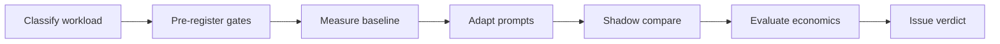
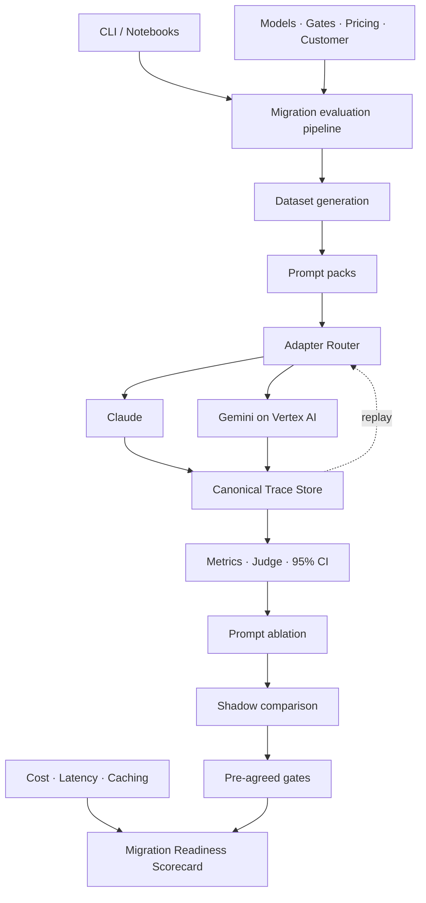
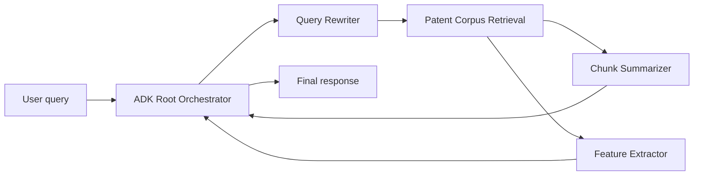

# Agent Migration Workbench

**Make model-migration decisions with measured evidence—not endpoint-swap intuition.**

Agent Migration Workbench (AMW) is a reproducible decision system for determining whether individual high-volume agent workloads are ready to migrate from one foundation model to another.

This repository demonstrates the method by evaluating three RAG subagents migrating from **Claude Sonnet 5** to **Gemini**:

- **Query Rewriter** — transforms a user request into a retrieval plan.
- **Chunk Summarizer** — produces a grounded summary from retrieved chunks.
- **Feature Extractor** — returns structured features from source documents.

The workbench runs the incumbent and candidate over the same corpus, adapts prompts through an explicit ablation ladder, examines shadow disagreements, evaluates pre-registered confidence-bound gates, and produces a per-subagent **Migration Readiness Scorecard**.

> AMW is not an automatic code converter and not a general claim that one model is better than another. It is a method for deciding whether one behavior, on one workload, under one agreed acceptance contract, is ready to migrate.

## Why this exists

“Can we replace Claude with Gemini in our agent?” is usually the wrong unit of analysis.

An agent system contains behaviors with different failure modes:

| Behavior class | What the model decides | Appropriate evaluation |
|---|---|---|
| Single-call transformation | The content and structure of one response | Gold references, schemas, groundedness and rubric scoring |
| Tool selection | Which tool to call and with which arguments | Tool-choice and argument-correctness evaluation |
| Retrieval | What evidence enters the context | Recall, precision and ranking evaluation |
| Multi-step orchestration | What to do next across a trajectory | Trajectory, state-transition and task-completion evaluation |

This reference implementation measures the first category in full. Tool selection, retrieval quality and multi-step orchestration require their own instruments and receive no migration verdict from this scorecard.

## The decision flow



1. **Classify the workload.** Define the behavior being migrated and select the matching evaluation instrument.
2. **Pre-register the gates.** Agree what “safe to migrate” means before seeing any result.
3. **Measure the baseline.** Run the incumbent, a naive candidate swap and adapted candidates over the same corpus.
4. **Adapt prompts.** Use an A0–A4 ladder to isolate which changes improve or damage performance.
5. **Shadow compare.** Measure structured agreement and adjudicate meaningful disagreements.
6. **Evaluate economics.** Add measured token cost, latency and caching analysis without mixing projections into measurements.
7. **Issue a verdict.** Produce a separate decision for each applicable subagent behavior.

## Reference architecture



Three architectural rules keep the evidence reproducible:

- **Mode resolution happens once.** `amw/adapters/__init__.py` is the only layer that decides between replay, hybrid and live execution.
- **Every live call is recorded.** Live adapters are always wrapped in `RecordingAdapter`; successful and failed calls are written to the canonical trace store.
- **Replay and live share one trace interface.** Evaluation code consumes the same trace schema regardless of how the response was obtained.

See [Architecture and toolchain](https://catwang42.github.io/agent-migration-workbench/architecture/) for the detailed component walkthrough.

## What the reference study found

The reference corpus contains 70 synthetic, provenance-labelled patent-domain cases for each of the three subagents. The latest deployment-candidate scorecard compares Claude Sonnet 5 with Gemini 3.6 Flash using a minimised reasoning budget.

| Subagent | Current scorecard status | Evidence summary |
|---|---|---|
| Query Rewriter | **INCOMPLETE** — provisional `MIGRATE` | Applicable quality, schema, shadow, cost and latency evidence clears its routes; the globally configured groundedness gate is not applicable to a search-plan output. |
| Chunk Summarizer | **UNDETERMINED** | Schema, groundedness, shadow and cost pass; quality parity is not demonstrated at the registered confidence bound and the directional latency gate fails. |
| Feature Extractor | **UNDETERMINED** | Schema, groundedness, shadow alternative and cost pass; quality precision and directional latency do not clear the registered gates. |

These are useful findings, not failed demo choreography:

- The same candidate can be appropriate for one subagent and inappropriate for another.
- Prompt adaptation materially changes migration outcomes.
- Cost improvement does not override a quality or latency failure.
- Missing or inapplicable evidence is reported explicitly rather than silently converted into a pass.

The current `INCOMPLETE` and `UNDETERMINED` statuses also expose two decision-policy gaps: gate applicability must be defined per behavior class, and every possible non-blocking failure pattern needs a configured disposition. Until those policies are updated, AMW refuses to invent a decision.

Read the full [Migration Readiness Scorecard](https://catwang42.github.io/agent-migration-workbench/results/scorecard/) or browse the [results overview](https://catwang42.github.io/agent-migration-workbench/results/).

## Quickstart: verify everything offline

Replay mode uses previously executed model calls committed as canonical JSONL traces. It requires no cloud project, credentials or network access.

### 1. Create the environment

```bash
git clone https://github.com/catwang42/agent-migration-workbench.git
cd agent-migration-workbench

python3.11 -m venv .venv
source .venv/bin/activate
pip install -r requirements.txt
cp .env.example .env
```

Python 3.11 is required.

### 2. Run the offline integrity gate

```bash
python cli.py e2e --mode replay
pytest tests/ -q
```

`e2e` is a small committed-fixture integrity check. It exercises the normal phase-two evaluation path in replay mode and verifies that a scorecard can be rendered. It is not the full 210-case study and does not regenerate every frozen research artifact.

### 3. Re-render the canonical deployment scorecard

```bash
python scripts/render_candidate_scorecard.py \
  --candidate gemini-flash-current-capped \
  --out artifacts/results/scorecard.md
```

This assembles the frozen incumbent arms, deployment-candidate arms, shadow evidence, measured token-cost evidence and eligible same-region latency probes. All model generations are replayed from recorded calls; no new provider request is made.

### 4. Browse the workshop site locally

```bash
pip install -r requirements-docs.txt
python scripts/build_site.py
mkdocs serve
```

Open the local URL printed by MkDocs.

## Execution modes

All principal commands accept `--mode`. The default is `replay`.

| Mode | Gemini | Claude | Credentials | Intended use |
|---|---|---|---|---|
| `replay` | Recorded | Recorded | None | Reproduction, CI and offline workshops |
| `hybrid` | Live | Recorded | Google Cloud ADC | Default customer workshop mode |
| `live` | Live | Live | Google Cloud ADC; optional Anthropic key for direct access | New measurement campaigns |

Mode selection is resolved centrally by `AdapterRouter`. Call sites do not branch on provider or execution mode.

### Replay

```bash
python cli.py phase2 --mode replay -n 10
python cli.py shadow --mode replay
python cli.py scorecard
```

Replay lookup is keyed by `(subagent, model, input_sha)`. A missing trace raises a replay miss; the system never substitutes a nearby response or fabricates a result.

### Hybrid

Hybrid keeps the incumbent baseline stable while measuring the migration candidate live:

```bash
gcloud auth application-default login
python cli.py smoke --mode live -n 2
python cli.py phase2 --mode hybrid -n 10
```

Set `PROJECT_ID`, `REGION`, `CLAUDE_REGION` and `CLAUDE_PATH` in `.env` before using a live endpoint.

### Live

Use live mode to create a new evidence campaign:

```bash
python cli.py phase2 --mode live -n 70
```

Every live call—including errors—is appended to `artifacts/replay/`. Review and intentionally commit new trace data only when it is safe and appropriate to preserve it.

## Run the migration workflow

### Generate a deterministic reference corpus

```bash
python cli.py gen \
  --customer demo_patents \
  -n 70 \
  --no-naturalise
```

Remove `--no-naturalise` and select a live-capable mode to enable the guarded surface-realism pass.

### Measure the baseline and candidate arms

```bash
python cli.py phase2 \
  --mode hybrid \
  --customer demo_patents \
  -n 70
```

Phase two compares the Claude baseline, naive Gemini swap and tuned Gemini prompt over the same corpus. It computes deterministic metrics, optional rubric-judge results and bootstrap confidence ranges.

### Run the prompt-ablation ladder

```bash
python cli.py ablate \
  --mode hybrid \
  --subagent query_rewriter
```

The ladder reuses the same arm runner and scoring implementation as phase two, keeping rung results comparable with the baseline.

### Compare shadow behavior

```bash
python cli.py shadow \
  --mode hybrid \
  --baseline-arm claude_baseline \
  --candidate-arm gemini_tuned_v1
```

Shadow analysis measures structured agreement and creates a disagreement-triage artifact instead of hiding meaningful differences behind one aggregate score.

### Render a scorecard

```bash
python cli.py scorecard \
  --results artifacts/results/phase2_n70.json \
  --shadow artifacts/results/shadow.json \
  --out artifacts/results/scorecard_development.md
```

For the current deployment candidate, use `scripts/render_candidate_scorecard.py` as shown in the quickstart.

## The ADK reference application

The repository includes a Gemini-backed Google ADK reference application that demonstrates what the migrated application could look like:



Run it with:

```bash
python cli.py adk-demo --mode live
```

The ADK application and migration evidence harness are deliberately separate:

- The **evidence harness** determines whether migration gates pass.
- The **ADK application** demonstrates the deployment architecture.
- The application reads the same shipping prompt files as the measured candidate.
- The app uses its own `adk_demo` model role, so changing the demo backend cannot alter a measured arm.
- The ADK demo does not create, change or approve a migration verdict.

## Decision contract

All thresholds and verdict rules live in [`config/gates.yaml`](config/gates.yaml). They are not duplicated in code.

The current contract considers:

| Gate | Question |
|---|---|
| `quality_delta_pp` | Does the candidate remain within the agreed quality margin? |
| `json_schema_validity` | Does it reliably satisfy the output contract? |
| `groundedness_delta_pp` | Does source support remain within the agreed margin where groundedness applies? |
| `shadow_agreement` | Does candidate behavior agree sufficiently with the incumbent, or clear the pre-agreed adjudication route? |
| `cost_savings_pct` | Does measured or confirmed-volume economics clear the agreed threshold? |
| `latency_p95` | Does candidate tail latency remain within the baseline bound on comparable infrastructure? |

Minimum gates are checked against the lower confidence bound; maximum gates are checked against the upper confidence bound. AMW therefore reports:

> Quality parity within measurement under pre-agreed gates.

It never claims “zero quality drop.”

### Verdict semantics

The workbench distinguishes five states:

| State | Meaning |
|---|---|
| `MIGRATE` | Every applicable pre-agreed gate passes. |
| `TUNE_FIRST` | Blocking structural gates pass, but one or more remediable gates fail. |
| `HOLD` | A blocking schema, safety or behavioral-control gate fails. |
| `INCOMPLETE` | Evidence required by the contract was not measured. |
| `UNDETERMINED` | The measured failure pattern has no configured decision rule. |

`INCOMPLETE` and `UNDETERMINED` are not softened passes. They are explicit signals that the evidence contract or decision policy must be completed before migration approval.

## Credibility contract

The following rules are enforced in code wherever possible:

1. **No fabricated results.** Every reported measurement comes from an executed model call or an explicit calculation over recorded calls.
2. **Provenance everywhere.** Dataset items carry provenance and generator metadata; reports carry model, region, run-window and gate-version evidence.
3. **Pre-registered gates.** Acceptance thresholds are agreed before results are inspected.
4. **Prices have one source.** Model rates live only in `config/pricing.yaml` and carry verification metadata.
5. **Replay works without credentials.** Provider SDKs are imported lazily and the offline integrity path is tested.
6. **Record-on-live is mandatory.** Successful and failed calls are preserved in the canonical trace schema.
7. **Missing evidence never becomes a pass.** A gate that cannot be evaluated remains visible in the report.
8. **Notebooks stay thin.** Logic lives in `amw/`; notebooks import, execute and display.

## Repository map

```text
cli.py                          Unified command-line entry point
config/
  models.yaml                  Logical model registry, IDs and regions
  gates.yaml                   Acceptance thresholds and verdict policy
  pricing.yaml                 Verified rates and sources
  customers/                   Domain, seed, region and volume profiles
amw/
  adapters/                    Claude, Gemini, replay and mode resolution
  agents/                      Prompt packs, schemas and ADK reference app
  datasets/                    Synthetic corpus and rubric generation
  traces/                      Canonical trace schema and replay store
  eval/                        Metrics, judges, statistics and cross-checks
  tuning/                      Ablation, translation and optimisation
  shadow/                      Agreement, emission analysis and triage
  economics/                   Cost, measured savings and cache breakeven
  reporting/                   Evidence assembly, charts and scorecards
artifacts/
  replay/                      Recorded model calls
  results/                     Frozen measurements and scorecards
notebooks/                     Thin workshop notebooks
site_src/                      Public workshop companion source
scripts/                       Measurement, audit, rendering and site tools
tests/                         Offline unit, integration and replay tests
```

## Use AMW for another workload

A new migration assessment normally requires:

1. Add a customer or workload profile under `config/customers/`.
2. Select incumbent, candidate and judge roles in `config/models.yaml`.
3. Review gate applicability and thresholds in `config/gates.yaml` before running the campaign.
4. Create or import representative workload items with explicit provenance.
5. Add prompt packs and typed output schemas for the new subagent behaviors.
6. Record incumbent and candidate calls.
7. Run baseline, adaptation, shadow and scorecard stages.
8. Review the evidence and decision with the system owner.

The included patent corpus is synthetic and exists to make the complete method inspectable. A production migration decision should be repeated using representative customer workloads and production-like infrastructure.

## Documentation

- [Workshop companion](https://catwang42.github.io/agent-migration-workbench/)
- [Setup](https://catwang42.github.io/agent-migration-workbench/setup/)
- [Models in this study](https://catwang42.github.io/agent-migration-workbench/models-in-this-study/)
- [Architecture and toolchain](https://catwang42.github.io/agent-migration-workbench/architecture/)
- [Method modules](https://catwang42.github.io/agent-migration-workbench/#the-eight-modules)
- [Results](https://catwang42.github.io/agent-migration-workbench/results/)
- [Migration Readiness Scorecard](https://catwang42.github.io/agent-migration-workbench/results/scorecard/)
- [`WORKSHOP_RUNBOOK.md`](WORKSHOP_RUNBOOK.md) — facilitator-only run-of-show and fallback plan

## Current scope and limitations

- The reference corpus is synthetic, although every model output and reported measurement is real and replayable.
- Current migration verdicts cover Level-1 single-call transformations only.
- The same-region latency probes are small and directional; production latency must be measured on production infrastructure.
- Volume-based monthly and annual economics remain unavailable until a real customer confirms their workload volumes.
- The committed `docs/master_plan.md` is design history and future-state context; it does not describe only the currently shipped surface.
- BYOT trace converters described in future-state planning are not part of the current reference workflow unless corresponding implementation and tests are present.

## For contributors

Before every change:

```bash
pytest tests/ -q
python cli.py e2e --mode replay
```

When changing public workshop content:

```bash
python scripts/build_site.py
mkdocs build --strict
```

Do not hard-code model IDs, prices or gate thresholds in Python. Do not add a switch that disables live-call recording. Do not repair malformed model output before scoring it; schema failure is evidence.

---

**Agent Migration Workbench demonstrates a migration decision, not a preferred model.** The result is allowed to be `MIGRATE`, `TUNE_FIRST`, `HOLD`, `INCOMPLETE` or `UNDETERMINED`—because a system that cannot say “not yet” cannot protect a production migration.
