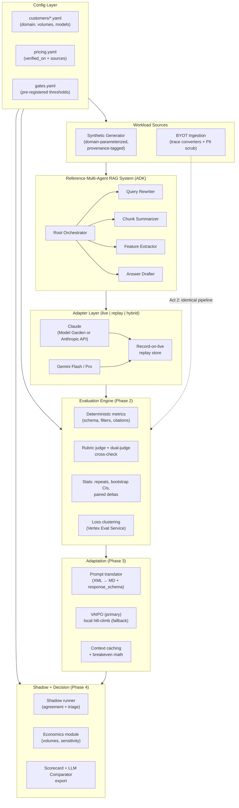

# Implementation Plan: Agent Migration Workbench (AMW)
## Claude → Gemini Migration — Workshop + Conversion Kit

One repository, two jobs:

1. **Act 1 — The Workshop (tech win).** A ~3-hour hands-on session run on synthetic-but-realistic RAG subagent workloads with **real model calls** through Google's **real migration stack** (ADK, Vertex GenAI Evaluation Service, VAIPO, Model Garden). Deliverable: a defensible Migration Readiness Scorecard showing quality parity under pre-agreed gates, plus structural cost (30–60%+, up to 75–90% input-side with caching) and latency advantages on utility subagents.
2. **Act 2 — The Conversion (the real prize).** A **BYOT (bring-your-own-traces) bridge**: the customer exports production traces into a defined schema, and the *identical* pipeline reruns on their real data. The workshop earns the right to ask for logs; this module makes saying yes nearly free for them.

The core is **source-model-agnostic** (any → Gemini); Claude adapters ship first. All model IDs and prices live in config, never in code.

### Design Principles (the credibility contract)

1. **Real calls, synthetic inputs, labeled provenance.** Every dataset item carries `provenance: synthetic|customer`. No simulated results are ever presented as measurements. Simulation exists only in the replay layer, which replays *previously recorded real calls* and says so on screen.
2. **Pre-registered gates.** Acceptance thresholds (`config/gates.yaml`) are agreed with the customer *before* Phase 2 runs. The scorecard is the gates evaluated, nothing more.
3. **Deliberate imperfection is the proof.** The reference system intentionally includes at least one subagent (Answer Drafter) that lands in "TUNE FIRST" out of the box. An eval that catches a weak candidate is the strongest evidence the methodology protects the customer.
4. **Everything runs without keys.** Replay mode executes the entire workshop from recorded traces — no quota, network, or Model Garden enablement can kill the demo.
5. **Config-driven reuse.** A new customer engagement = one YAML profile + a regenerated domain dataset. Target re-skin time: under one day.
6. **The edge claim that survives scrutiny.** Cost and latency advantages on high-volume utility subagents are structural (pricing × model class). The pipeline's only job is to demonstrate quality parity under the agreed gates. A rigged demo wins a meeting; this wins the migration.

---

## 1. Sales-Motion Mapping

| Workshop artifact | What it earns | Conversion step it unlocks |
|---|---|---|
| Gates sign-off (`gates.yaml`) | Shared definition of "safe to migrate" | Same gates reused verbatim on real traces |
| Baseline + ablation ladder | Belief that tuning (not luck) closes gaps | Scoped tuning engagement per subagent |
| Honest scorecard (incl. TUNE FIRST rows) | Trust in the methodology | Permission to run it on production data |
| ROI at *their* volumes, verified pricing | CFO-safe savings number | Budget conversation |
| `docs/data_request_onepager.md` | A concrete, low-effort ask | Trace export within ~1 customer-day |
| `notebooks/04_byot_real_traces.ipynb` | Proof the pipeline ingests their format | Real-data evaluation → migration decision |

---

## 2. Architecture



---

## 3. Repository Layout

```
agent-migration-workbench/
├── README.md
├── WORKSHOP_RUNBOOK.md                # Run-of-show, timings, fallback tree, talk track
├── pyproject.toml / requirements.txt  # google-adk, google-genai, anthropic, vertexai,
│                                      # pydantic, rich, pandas, matplotlib, papermill, pytest
├── .env.example
├── cli.py                             # Phase runners: gen | phase2 | tune | shadow | e2e | smoke
│
├── config/
│   ├── models.yaml                    # Model IDs, endpoints, regions, judge config
│   ├── pricing.yaml                   # $/1M tokens + cached rates; verified_on + source URLs
│   ├── gates.yaml                     # Pre-registered acceptance thresholds
│   └── customers/
│       ├── _template.yaml
│       └── demo_patents.yaml          # Default workshop profile
│
├── amw/                               # Core package
│   ├── adapters/                      # base.py, claude_vertex.py, claude_anthropic.py,
│   │                                  # gemini.py, replay.py  (modes: live|replay|hybrid)
│   ├── agents/                        # ADK reference system (reuses Plan 3 agent code),
│   │                                  # model injected via config; response_schema strict
│   ├── datasets/                      # generator.py (domain-parameterized), schemas.py,
│   │                                  # rubrics.py (per-item adaptive rubrics + gold refs)
│   ├── traces/                        # schema.py, converters/ (anthropic_logs, langsmith,
│   │                                  # langfuse, adk_vertex, generic_csv), pii_scrub.py
│   ├── eval/                          # metrics.py, judge.py (dual-judge), stats.py,
│   │                                  # runner.py, loss_clusters.py
│   ├── tuning/                        # translator.py, apo.py (VAIPO + local fallback),
│   │                                  # context_cache.py (incl. breakeven calculator)
│   ├── shadow/                        # runner.py, agreement.py, triage.py
│   ├── economics/                     # cost_model.py, sensitivity.py
│   └── reporting/                     # scorecard.py (md+html), charts.py,
│                                      # comparator_export.py (LLM Comparator JSON)
│
├── notebooks/
│   ├── 00_setup_smoke_test.ipynb
│   ├── 01_baseline_eval.ipynb         # Pre-run full set; live 10-case subset in session
│   ├── 02_tuning_vaipo.ipynb          # Ablation ladder + VAIPO run
│   ├── 03_shadow_scorecard.ipynb      # Gates → verdicts → exec scorecard
│   └── 04_byot_real_traces.ipynb      # Act 2: point at customer JSONL, rerun everything
│
├── artifacts/                         # Recorded traces + pre-run results (replay corpus)
├── scripts/
│   ├── refresh_pricing.py             # Interactive T-2-days pricing verification
│   └── record_replay_corpus.py
├── tests/                             # Golden-fixture metric tests, replay e2e
└── docs/
    ├── migration_decision_framework.md  # Gates G0–G4 one-pager (customer-facing)
    ├── data_request_onepager.md         # Exact export spec + sampling + privacy notes
    ├── objection_handling.md            # Fairness, judge neutrality, synthetic data, pricing
    └── risk_register.md                 # Failure modes + rollback plan
```

---

## 4. Configuration System

**`models.yaml`** — every model reference resolves here (Claude via Model Garden `@vertex-ai` *and* direct Anthropic API, since customers sit on either path; Gemini Flash-class for subagents, Pro-class for judging). The three source plans disagreed on exact model names (Sonnet 4.8 vs Opus 4.8 vs Opus 5) — config makes that a one-line fix per engagement instead of a code hunt.

**`pricing.yaml`** — resolves the price contradictions between the source plans structurally rather than by picking a side:

```yaml
# Prices are NEVER hardcoded elsewhere. scripts/refresh_pricing.py walks you
# through re-verification; the scorecard footer prints verified_on + sources.
verified_on: null            # set at T-2 days before each delivery
sources:
  - https://cloud.google.com/vertex-ai/generative-ai/pricing
  - https://claude.com/pricing            # or Vertex partner-model pricing page
models:
  gemini-flash:      {input_per_1m: VERIFY, output_per_1m: VERIFY, cached_input_per_1m: VERIFY}
  gemini-pro:        {input_per_1m: VERIFY, output_per_1m: VERIFY, cached_input_per_1m: VERIFY}
  claude-sonnet:     {input_per_1m: VERIFY, output_per_1m: VERIFY, cached_input_per_1m: VERIFY}
  claude-opus:       {input_per_1m: VERIFY, output_per_1m: VERIFY, cached_input_per_1m: VERIFY}
cache_storage:       {per_1m_token_hour: VERIFY}   # needed for honest caching breakeven
```

**`gates.yaml`** — the pre-registration mechanism. Reviewed with the customer in the opening segment; changing it afterward requires re-sign-off:

```yaml
# Agreed with customer BEFORE Phase 2 executes.
subagent_gates:
  quality_delta_pp:      {min: -2.0, basis: "95% CI lower bound vs Claude baseline"}
  json_schema_validity:  {min: 0.99}
  groundedness_delta_pp: {min: -1.0}
  shadow_agreement:      {min: 0.90, alt: "judge-adjudicated wins >= losses on disagreements"}
  cost_savings_pct:      {min: 30, basis: "customer volumes, uncached; caching reported separately"}
  latency_p95:           {max: "claude_baseline_p95, same region"}
verdicts:
  MIGRATE:     all gates pass
  TUNE_FIRST:  only quality/groundedness gates fail
  HOLD:        schema compliance or agreement gates fail
```

**`customers/*.yaml`** — domain, subagent volume profiles (calls/day, avg in/out tokens), target region, chosen models, optional real sample queries. This file is the entire per-customer surface area.

---

## 5. Component Specifications

### 5.1 Adapter Layer & Execution Modes (Plan 2's best idea, promoted)

```python
class ExecutionMode(str, Enum):
    LIVE   = "live"     # real API calls; every call auto-recorded to artifacts/
    REPLAY = "replay"   # serves recorded traces; banner shows recording date
    HYBRID = "hybrid"   # Gemini live + Claude replayed (default workshop mode)
```

- **Record-on-live**: every live call (including rehearsals) appends to the replay corpus, so demo insurance accrues automatically — no separate "prepare mock data" step.
- **Hybrid** is the default workshop mode: the Gemini side is provably live in front of the customer; the Claude baseline replays recorded real calls, which sidesteps Model Garden enablement and billing questions in the customer's project.
- Claude adapters: `claude_vertex.py` (Model Garden) and `claude_anthropic.py` (direct API) behind one interface — matches wherever the customer's production actually runs.

### 5.2 Reference Multi-Agent System (from Plan 3, unchanged in spirit)

Five ADK agents — Root Orchestrator, Query Rewriter, Chunk Summarizer, Feature Extractor, Answer Drafter — with the model injected from config so identical agent code runs on both backends. Subagents use `response_schema` strict structured output. The demo narrative mirrors the recommended strategy: **migrate utility subagents first, keep the orchestrator on its current model until Phase 2 of the customer's own rollout.** Plan 3's agent implementations are reused nearly as-is; only the model plumbing changes.

### 5.3 Synthetic Workload Generator (merged from Plans 1 & 3, parameterized)

- **Domain-parameterized**: patents by default; finance/legal/support variants generated from the same templates via the customer YAML (`cli.py gen --customer acme -n 200`). If discovery yields 10–20 real sample queries, they seed the generator — the single highest-leverage relevance upgrade.
- **Case mix** per subagent: 40% simple, 25% multi-hop, 20% structured extraction, 15% edge/adversarial (ambiguous, out-of-scope, injection-flavored).
- Every item ships with **gold reference output + per-item adaptive rubric** (3–5 pass/fail criteria) + `provenance` tag + generator seed for reproducibility.
- Target sizes: 150–250 cases per subagent for deterministic metrics; a stratified **50-case core set** per subagent for judged metrics (cost-controlled repeats — see 5.4).

### 5.4 Evaluation Engine (Phase 2) — where the tech win is decided

**Metric stack, cheapest-first:**
1. **Deterministic**: JSON schema validity, exact-key match, filter extraction precision/recall, citation coverage (every claim maps to a source chunk id).
2. **Vertex GenAI Eval Service rubric metrics**: final response quality, tool-use quality, hallucination/groundedness — plus **loss clustering** for the failure-taxonomy walkthrough (Plan 3's flow, kept).
3. **LLM-as-judge**, rubric-anchored, with rationales captured and judge prompts published in the repo.

**Dual-judge neutrality protocol (new — preempts the "home referee" objection):**
- Primary judge: Gemini Pro-class. Cross-check: a **Claude Opus-class judge re-scores a 20% stratified sample**; report percent agreement and Cohen's κ in the scorecard footer.
- If agreement < 85% on any metric: human spot-label ~30 items, recalibrate the rubric, rerun. The protocol itself is a talking point — you're showing the customer how to keep *their* future evals honest.

**Statistical treatment (new — turns "parity" from adjective into claim):**
- Judged metrics: core set × **k=3 repeats** (production temperatures), report mean + bootstrap 95% CI.
- Deltas vs baseline: paired bootstrap; **parity is claimed only when the CI lower bound clears the gate**. Error bars on every chart.
- The **naive-swap lane runs deliberately and is shown failing** — it motivates Phase 3 and inoculates against "so I can just switch the endpoint myself."

### 5.5 Adaptation & Tuning (Phase 3)

**Prompt translator** (`tuning/translator.py`): mechanical, inspectable conversion — Claude XML tags → system-instruction separation + Markdown sectioning; tool definitions → OpenAPI declarations; output contracts → `response_schema` strict mode; few-shot recalibration. Emits a side-by-side diff for the teaching moment.

**APO**: **VAIPO is the primary path** (it's the platform capability being sold). A **local hill-climb optimizer** (Plans 1/2) ships as the offline fallback so the tuning segment works even if the managed service is unavailable — same failure-cluster-driven loop, clearly labeled as the fallback.

**Context caching with honest math** (`tuning/context_cache.py`): demonstrates caching the shared system prompt + RAG corpus preamble across high-volume subagent calls, and computes the **breakeven point** (cache write/storage cost vs per-call read savings, TTL tuning) at the customer's volumes. Report "75–90% input-token cost reduction *above breakeven volume X*" — a claim with a visible denominator beats a bigger claim without one.

**Ablation ladder (new)** — the core teaching artifact, run per subagent:

| Rung | Change | Isolates |
|---|---|---|
| A0 | Naive endpoint swap (Claude XML verbatim) | the "why tuning matters" gap |
| A1 | + Markdown / system-instruction restructure | format sensitivity |
| A2 | + strict `response_schema` / OpenAPI tools | structured-output compliance |
| A3 | + few-shot recalibration | task calibration |
| A4 | + VAIPO-optimized instruction | automated optimization lift |
| A5 | + context caching | cost only (quality flat — shown to prove it) |

### 5.6 Shadow Runner & Decision Engine (Phase 4)

- Parallel execution of the same inputs on both backends; full traces recorded in the canonical schema (5.9).
- **Agreement metrics**: exact match for structured outputs; embedding similarity for prose; and — the part customers remember — **disagreement triage**: every disagreement is judge-adjudicated into win/loss/tie, so "agreement 91%" comes with "and of the 9%, Gemini won 5, lost 2, tied 2."
- **Latency discipline**: TTFT + end-to-end, p50/p95, measured from the customer's target region, variance shown. No pre-baked "3.2× faster" claims — the numbers are whatever the room measures.
- Gates from `gates.yaml` evaluate automatically → per-subagent **MIGRATE / TUNE_FIRST / HOLD** verdicts.

### 5.7 Economics Module

- Cost model reads `pricing.yaml` + the customer's volume profile; outputs per-subagent daily/monthly/annual costs, savings %, and **sensitivity across volume scenarios** (0.5×/1×/2×) — with and without caching, separately.
- Scorecard footer prints `pricing verified_on` + source URLs. Customers fact-check pricing on their phones mid-meeting; beat them to it.

### 5.8 Reporting

- **Executive scorecard** in Markdown + HTML (shape in §6), charts with error bars, and an **LLM Comparator JSON export** so a skeptical engineer can browse raw side-by-side outputs during Q&A instead of trusting aggregates.

### 5.9 BYOT Bridge (Phase 5 — the conversion engine, new)

**Canonical trace schema** (JSONL, aligned with OTel GenAI semantic conventions):

```json
{"trace_id": "qr-000123", "subagent": "query_rewriter", "provenance": "customer",
 "ts": "2026-08-03T10:22:41Z", "model": "claude-sonnet", "system_prompt_sha": "ab12…",
 "input": {"messages": ["…"], "context_chunks": ["…"]},
 "tools_offered": ["emit_query_plan"],
 "tool_calls": [{"name": "emit_query_plan", "args": {"…": "…"}}],
 "output": {"text": null, "json": {"…": "…"}},
 "usage": {"input_tokens": 812, "output_tokens": 196, "cached_tokens": 0},
 "latency_ms": {"ttft": 410, "total": 890}}
```

- **Converters**: Anthropic API logs, LangSmith exports, Langfuse exports, ADK/Vertex traces, generic CSV. Each converter is ~100 lines against the schema above.
- **PII scrubbing pass** (`traces/pii_scrub.py`): regex-based redaction (emails, phones, IDs) with optional Cloud DLP / Sensitive Data Protection integration; emits a **redaction report** the customer's security team can review before anything leaves their boundary. This is frequently the difference between "we'll think about sharing logs" and "here's the export."
- **`notebooks/04_byot_real_traces.ipynb`**: point at a customer JSONL → identical metrics, identical gates, identical scorecard. The closing pitch writes itself: *"Same pipeline you just watched — your data, your gates. Here's the export spec; it's about a day of your team's time."*
- **`docs/data_request_onepager.md`**: exactly what to export — target N per subagent (≥200), required fields, stratified sampling guidance (by intent/length/date), redaction expectations, and the privacy handling above.

---

## 6. The Executive Scorecard (target shape)

Rendered per subagent from gate evaluation — including the deliberately honest rows:

| Subagent | Quality (Δpp, 95% CI) | Schema Validity | Agreement (win/loss/tie) | Cost Savings* | Latency p95 | **Verdict** |
|---|---|---|---|---|---|---|
| Query Rewriter | +1.2 [−0.4, +2.8] | 99.4% | 93% (5/1/3) | −__% | faster | ✅ **MIGRATE** |
| Chunk Summarizer | +0.6 [−1.1, +2.3] | 99.1% | 91% (4/2/3) | −__% | faster | ✅ **MIGRATE** |
| Feature Extractor | +1.8 [+0.2, +3.4] | 99.7% | 95% (3/1/1) | −__% | faster | ✅ **MIGRATE** |
| Answer Drafter | −2.9 [−4.6, −1.2] | 99.0% | 87% (2/6/3) | −__% | faster | 🔄 **TUNE_FIRST** |
| Root Orchestrator | *(not evaluated — Phase 2 of customer rollout by design)* | | | | | ⏸ **PHASE 2** |

Footer (auto-generated): dataset provenance + generator seed · judge agreement (%, κ) · pricing `verified_on` + sources · region + run date · gates version hash.

*Cost columns populate from `pricing.yaml` at delivery — never shipped pre-filled.*

Framing rule baked into the template: **"quality parity within measurement on this workload under pre-agreed gates"** — never "zero quality drop." The TUNE_FIRST row is presented as the methodology working, then §5.5's ablation ladder is shown closing exactly that kind of gap.

---

## 7. Objection Handling (`docs/objection_handling.md`)

| Objection | Pre-loaded answer |
|---|---|
| "Did you tune the Claude prompts as hard as the Gemini ones?" | The migration question is *your current production system* vs *tuned Gemini* — your existing prompts are the baseline being migrated. **Optional fairness lane**: if the customer wants best-vs-best, the same APO loop runs on the Claude side too; the structural cost/latency case holds either way, which is a confident position to offer from. |
| "Gemini judging Gemini vs Claude?" | Dual-judge protocol (§5.4): Claude Opus-class re-scores a 20% sample; agreement + κ printed on the scorecard; judge prompts are in the repo; human spot-labels on low agreement. |
| "This is synthetic data." | Correct, and labeled as such on every artifact — which is exactly why Act 2 exists. The methodology is the product; the one-pager in your hands converts it to your data in about a day. |
| "Are these prices current?" | `verified_on` date + source URLs on the scorecard; re-verified at T-2 days per delivery. |
| "The demo numbers look too good." | Point at the TUNE_FIRST row and the CI error bars. A pipeline that only ever says yes would be worthless to you; this one demonstrably says no. |

---

## 8. Workshop Run-of-Show (~3h, default HYBRID mode)

| Time | Segment | Assets | Live vs pre-run |
|---|---|---|---|
| 0:00–0:20 | Decision framework + **gates sign-off** (customer agrees what "pass" means) | `docs/migration_decision_framework.md`, `gates.yaml` | discussion |
| 0:20–0:50 | Architecture mapping + cost calculator **at their volumes** | `economics/`, customer YAML | live (cheap, safe) |
| 0:50–1:15 | Reference system walkthrough; same agent code, both backends | `amw/agents/`, `cli.py` | live hybrid run, 2–3 queries |
| 1:15–2:05 | Baseline eval: pre-run full results + **live 10-case subset**; loss clusters; naive-swap failure; ablation ladder + VAIPO | notebooks 01–02 | full set pre-run; subset + one VAIPO iteration live |
| 2:05–2:35 | Shadow scorecard + disagreement triage + ROI; LLM Comparator browsing for skeptics | notebook 03, Comparator export | pre-run + live browse |
| 2:35–2:55 | Verdicts vs gates → **the ask**: hand over `data_request_onepager.md`, agree pilot subagents, schedule the real-trace eval | docs/ | discussion |
| 2:55–3:00 | Wrap | | |

**Fallback tree** (one flag, identical narration): `--mode live` → `--mode hybrid` → `--mode replay`. Plan 1's sequential master-runner survives as `cli.py demo --mode replay` — the pacing device if notebooks misbehave. Never run the heavy eval live; the 10-case live subset proves realness, the pre-run provides the statistics.

---

## 9. Verification Plan

**Automated (CI, no keys required):**
```bash
pytest tests/                                  # golden-fixture tests for every metric
python cli.py e2e --mode replay                # full pipeline end-to-end from recorded traces
papermill notebooks/0{1,2,3}_*.ipynb /tmp/out  # every notebook executes clean in replay mode
python -m amw.traces.converters --selftest     # round-trip each converter against schema fixtures
```

**Live smoke (pre-rehearsal):**
```bash
python cli.py smoke --mode live -n 3           # 3 cases/subagent on both backends; auto-records
```
Also validates against sketch-level SDK usage from the source plans: every Vertex Eval Service call, `RubricMetric` name, and VAIPO invocation is executed for real here — preview API surfaces shift, and nothing unexecuted goes in front of a customer.

**Rehearsal checklist (T-2 days):** region + quota confirmed · Claude path decided (Model Garden enabled / Anthropic key / replay-only) · `refresh_pricing.py` run, `verified_on` set · replay corpus fresher than 2 weeks · full replay-mode dry run timed against §8 · scorecard renders with real numbers · customer YAML volumes confirmed with account team.

---

## 10. Build Milestones (~10–13 working days)

| Milestone | Scope | Effort |
|---|---|---|
| M1 | Scaffold, config system, adapters + replay/record, ADK agents ported from Plan 3 | 2–3 d |
| M2 | Synthetic generator + rubrics; eval engine (deterministic → judge → dual-judge → stats) | 3–4 d |
| M3 | Translator, VAIPO integration + local fallback, caching breakeven, ablation runner | 2–3 d |
| M4 | Shadow runner, triage, economics, scorecard + Comparator export | 2 d |
| M5 | BYOT converters + PII scrub, docs (framework, one-pager, objections, risk register), notebook polish, recorded corpus, full rehearsal | 2–3 d |

---

## 11. Reuse Guide (per-customer re-skin, target < 1 day)

1. `cp config/customers/_template.yaml config/customers/acme.yaml` — set domain, volumes, region, models.
2. Drop in 10–20 real sample queries if discovery produced them (highest-leverage step).
3. `python cli.py gen --customer acme -n 200` — regenerate the domain dataset.
4. `python scripts/refresh_pricing.py` — set `verified_on`.
5. Pre-run Phases 2–3 in live mode (auto-builds the replay corpus for this customer).
6. Timed rehearsal in replay mode; review gates with the account team before the session.

---

## User Review Required

> [!IMPORTANT]
> **Claude access path**: Model Garden in your/customer GCP project, direct Anthropic API, or replay-only for the baseline? (Hybrid mode needs one recorded corpus regardless — built automatically during rehearsal.)

> [!IMPORTANT]
> **GCP project & region**: Confirm project ID, target region (latency is measured from there), and Vertex quotas for the live segments.

> [!IMPORTANT]
> **Customer domain & samples**: Patents remains the default synthetic domain — override in the customer YAML? Any real sample queries available from discovery?

> [!TIP]
> **Optional fairness lane**: Include the "APO-tuned Claude" comparison arm (adds ~0.5 day build + eval cost) — recommended when the customer's evaluators are senior ML engineers.

> [!TIP]
> **Format**: ~3h single session confirmed, or split into Session 1 (mapping + gates, 45 min) and Session 2 (pipeline, 2h+)?
